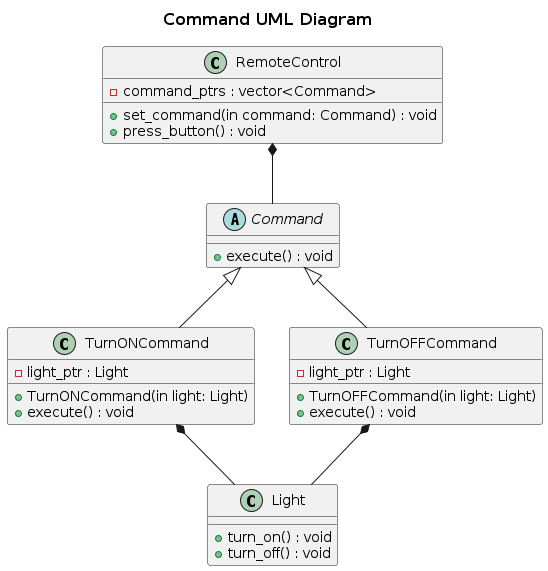

## Command
The Command pattern encapsulates a request as an object, allowing for parameterization, queuing, logging, and undo/redo operations.

### Real-World Analogy
Think of a restaurant:

- A waiter takes an order (command) from a customer.
- The order is placed in the kitchen queue.
- The chef executes the order when ready.
- The waiter doesn't need to know how the food is prepared, only that the order needs to be executed.

### Components
- Command (Abstract Class/Interface) – Declares an interface for executing operations.
- Concrete Command – Implements the command by calling appropriate methods on the receiver.
- Receiver – The actual business logic object that performs actions.
- Invoker – Stores and executes commands.
- Client – Creates commands and associates them with receivers.

### Problem
Directly invoking operations on objects can lead to tight coupling, making it hard to support undo/redo, macros, and request queuing.

### Solution
Decouple the sender and receiver by encapsulating actions as command objects. The invoker can execute, queue, or log commands flexibly.

### UML Diagram

  

### Advantages
- Decouples sender and receiver, making code more modular.
- Enables undo/redo by storing previous commands.
- Supports queuing and macros, allowing multiple commands to be executed sequentially.

### Disadvantages
- Increased complexity due to additional classes.
- May lead to memory overhead if storing many command objects.
