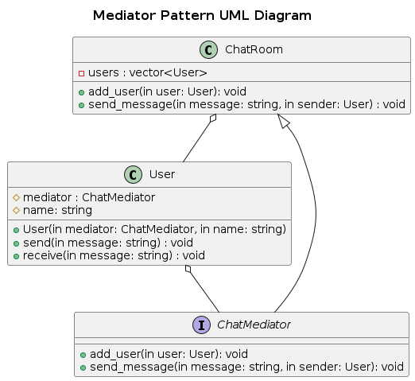

## Mediator
The Mediator Pattern is a behavioral design pattern that reduces direct dependencies between objects by introducing a mediator object. Instead of objects communicating directly, they send messages through a mediator, which handles communication and coordination.

### Real-World Analogy
Imagine an air traffic control (ATC) tower at an airport. Planes (colleagues) do not communicate directly with each other; instead, they send messages to the ATC (mediator), which coordinates takeoffs, landings, and other operations.

### Components
- Mediator (Interface): Declares communication methods used by different components.
- Concrete Mediator: Implements the mediator interface and coordinates communication between components.
- Colleague (Base Class/Interface): Represents objects that interact via the mediator.
- Concrete Colleague:	Specific objects that communicate through the mediator instead of directly.

### Problem
Consider a chat application where multiple users (colleagues) communicate. If each user directly sends messages to others, the system becomes tightly coupled and difficult to scale.

Without a mediator:
- Every user would need to store references to all other users.
- Adding/removing users would require updating existing users' connections.
- The system would become harder to maintain as users increase.

### Solution
Introduce a Chatroom (mediator) that manages message exchange between users.

- Users do not send messages directly to each other.
- Instead, they send messages to the mediator, which forwards them appropriately.
- This reduces dependencies between users and makes it easier to add/remove them.

### UML Diagram

### Advantages
- Reduces direct dependencies between objects.
- Improves maintainability by centralizing communication logic.
- Easier to extend (adding new objects without modifying existing ones).
- Encapsulates complex interactions into a single mediator.

### Disadvantages
- Mediator can become a bottleneck if it handles too much logic.
- Over-centralization may make the system harder to modify if too many responsibilities are added to the mediator.
- Less flexibility if the mediator needs to be modified frequently.
