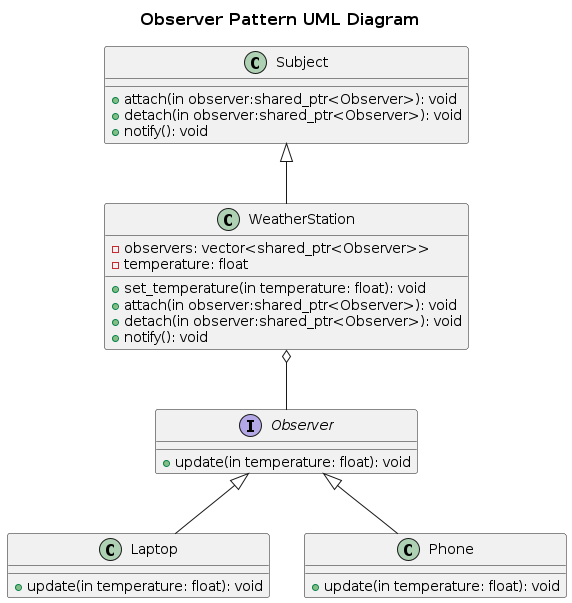

## Observer
The Observer Pattern is a behavioral design pattern where an object (subject) maintains a list of its dependents (observers) and automatically notifies them of any state changes.

### Real-World Analogy
Think of a YouTube subscription system:

- A YouTuber (Subject) uploads a new video.
- All Subscribers (Observers) get notified.
- If someone unsubscribes, they stop receiving updates.

### Components

- Subject (Publisher) – Maintains a list of observers and notifies them of changes.
- Observer (Subscriber) – Receives updates from the subject.
- ConcreteSubject – Implements the subject and tracks state changes.
- ConcreteObserver – Implements the observer and reacts to changes.

### Problem
Imagine a weather station that broadcasts temperature updates.
Without the Observer pattern:

- The station would have to manually inform each display unit (e.g., phone apps, smart home devices).
- Adding/removing displays would require modifying the weather station’s code.

###  Solution
Using the Observer Pattern, we:
- Allow multiple observers to listen to a subject.
- Automatically notify observers when the subject’s state changes.
- Decouple the subject from the observers, making the system flexible.

### UML Diagram

### Advantages
- Loose Coupling – Observers and subjects interact via an interface.
- Scalability – Easily add/remove observers without modifying the subject.
- Automatic Updates – Observers stay in sync with the subject.

### Disadvantages
- Performance Overhead – Frequent notifications can be costly.
- Complexity – Managing observer lists and updates requires careful implementation.
