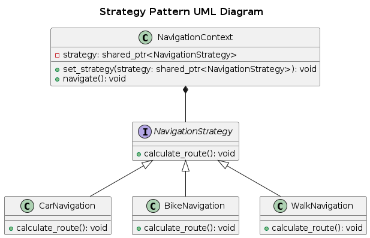

## Strategy

Strategy Pattern is a behavioral design pattern that allows selecting an algorithm’s behavior at runtime. Instead of implementing multiple algorithms in a single class, it encapsulates them into separate strategy classes and makes them interchangeable.

### Real-World Analogy
Imagine a navigation app (like Google Maps) that allows a user to select different transportation modes:

- Car navigation
- Bike navigation
- Walking navigation

Each mode has its own algorithm to calculate the best route, but the user can switch between them dynamically.

### Components
- Strategy Interface (NavigationStrategy) → Defines a common interface for all strategies.
- Concrete Strategies (CarNavigation, BikeNavigation, WalkingNavigation) → Implements specific algorithms.
- Context (NavigationContext) → Uses a strategy and delegates work to it.

### Problem
A navigation system is designed to support multiple modes of transport.

- Initially, all route calculation logic is inside a single class.
- As new modes (like trains or buses) are added, the class grows too complex.
- Changes to one algorithm may break others.

Issues with a Naïve Approach
- Tight Coupling: The main class has to know all algorithms.
- Difficult to Extend: Adding a new algorithm requires modifying the main class.
- Code Duplication: Similar logic may be repeated for different strategies.

### Solution
Use the Strategy Pattern:

- Encapsulate each navigation algorithm inside its own class.
- The main navigation system delegates route calculations to a selected strategy.
- Users can dynamically switch between strategies at runtime.

### UML Diagram

  

### Advantages
- Open-Closed Principle → Easily add new strategies without modifying existing code.
- Loose Coupling → The navigation system doesn’t depend on specific algorithms.
- Flexibility → Users can change strategies at runtime.

### Disadvantages
- Increased Complexity → More classes are introduced.
- Strategy Selection Overhead → Might require logic to choose the best strategy dynamically.
