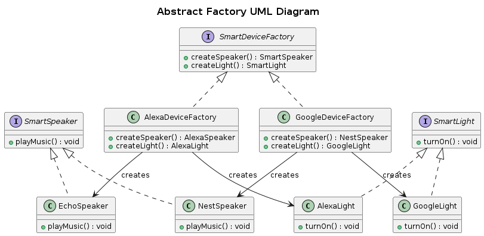

## Abstract Factory

The Abstract Factory design pattern provides an interface for creating families of related or dependent objects without specifying their concrete classes. It's like having a "factory of factories," where each factory produces a family of related objects.


### Real World Analogy

Scenario
Imagine you’re designing a home automation system that supports different "smart device ecosystems," such as:

- Amazon Alexa Ecosystem.
- Google Home Ecosystem.

Each ecosystem has its own set of smart devices:

- Smart Speaker
- Smart Light
-
You want the client code to work seamlessly with any ecosystem without worrying about the concrete classes of the devices. The Abstract Factory pattern can help achieve this.

```
Client
   |
SmartDeviceFactory (Abstract Factory)
   |--> AlexaDeviceFactory (Concrete Factory)
   |       |--> EchoSpeaker (Concrete Product - SmartSpeaker)
   |       |--> AlexaLight (Concrete Product - SmartLight)
   |
   |--> GoogleDeviceFactory (Concrete Factory)
           |--> NestSpeaker (Concrete Product - SmartSpeaker)
           |--> GoogleLight (Concrete Product - SmartLight)
```
### Components
- Abstract Factory (SmartHomeFactory) – Declares creation methods for each product type.
- Concrete Factories (GoogleDeviceFactory, AlexaDeviceFactory) – Implement product creation for a specific brand.
- Abstract Products (SmartSpeaker, SmartLight) – Define the interface for products.
- Concrete Products (NestSpeaker, GoogleLight, etc.) – Actual implementations of the products.
- Client (use_smart_home) – Uses the factory to create and use objects without knowing the exact class.

### Problem
- In large systems, objects often belong to families (e.g., GUI toolkits, smart home devices, etc.).
- Directly instantiating concrete classes leads to tight coupling, making it hard to switch between different product families.
- We need a way to create objects that belong together without hardcoding class dependencies.


### Solution
- Define an Abstract Factory that provides an interface for creating related objects.
- Implement multiple Concrete Factories, each producing a family of related objects.
- The client only interacts with the factory interface, ensuring flexibility and scalability.

### UML Diagram

<p align="center">
  
</p>

### Advantages
- Avoid tight coupling between concrete products and client code.
- Single Responsibility Principle. You can extract the product creation code into one place, making the code easier to support.
- You can introduce new variants of products without breaking existing client code.

### Disadvantages
- Complexity – Requires multiple factory classes, increasing initial setup effort.
- Difficult to Extend Individual Products – If you want to add a new product without modifying the factory, it can be challenging.
