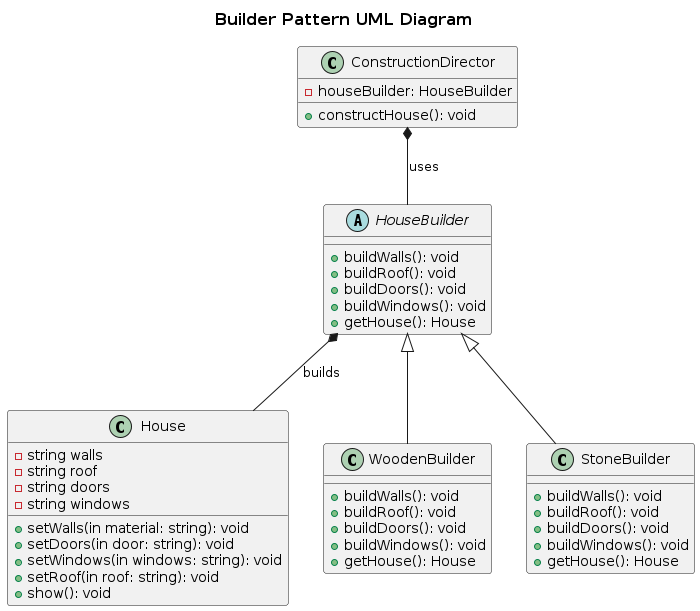

## Builder

 Builder Pattern is a design pattern used to construct complex objects step by step. It allows for the creation of different types and representations of an object using the same construction process. The builder pattern is particularly useful when the object to be created has many possible configurations, making it easier to construct it incrementally and flexibly.

### Real World Analogy

The Builder Pattern is like a chef in a restaurant. The chef is given instructions (via a recipe) to build a dish step by step, using the same set of ingredients (components). The client (restaurant customer) doesn’t need to know how the dish is prepared—only that they will get the dish with the desired components (e.g., wooden house or stone house). Each chef (builder) might use a slightly different process to prepare the dish, but the customer always receives the final product (food).

### Main Components

1. Product: Complex object that requires multiple steps to build
2. Builder (Abstract Builder): defines the contract all builders must follow
3. Concrete Builder: build the product step by step as per director's instruction
4. Director: ensures the construction process follows a specific sequence and steps

### Problem

We want to build different types of houses (e.g., a wooden house, a stone house) using the same construction process. The house has multiple components like walls, roof, doors, and windows, and each type of house might have different materials for each component.

### Solution

- House: The product, a house, is built incrementally by setting its components (walls, roof, doors, windows).
- HouseBuilder: The abstract builder that defines the steps for constructing the house.
- WoodenHouseBuilder and StoneHouseBuilder: Concrete builders that provide specific implementations for constructing wooden or stone houses.
- ConstructionDirector: It directs the building process, ensuring the house is built using the appropriate steps (walls, roof, doors, and windows).
- Client: The client asks the director to construct the house without knowing how each part is built. The director uses the builder to assemble the house.

### UML Diagram

  

### Advantages
- You can construct objects step-by-step, defer construction steps or run steps recursively.
- You can reuse the same construction code when building various representations of products.
- Single Responsibility Principle. You can isolate complex construction code from the business logic of the product.

### Disadvantages
The overall complexity of the code increases since the pattern requires creating multiple new classes.