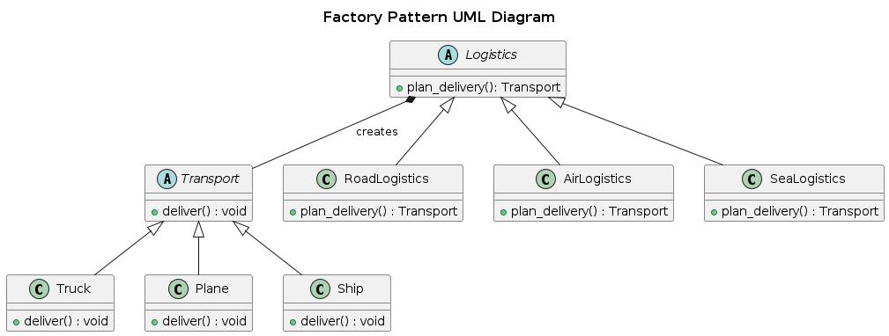

## Factory Method

The Factory Method is a creational design pattern that provides an interface for creating objects in a superclass but allows subclasses to alter the type of objects that will be created. This pattern delegates the responsibility of instantiation to subclasses, enabling more flexible and reusable code.

### Real World Analogy

- Logistics company is a base class
- Different modes of transport are the transport class
- Clients only interact with the logistic company with the requirement
  of mode of transport without worrying about the implementation details of the transport.

### Problem

Imagine we are building a logistics system where different types of logistics handle the delivery of goods. Depending on the type of logistics, the transportation can be via trucks, ships, or planes.

We need a way to create transport objects without hardcoding the transport type in our logic. This allows us to add new transport methods (like drones or trains) in the future without modifying existing code.

### Solution

We define a base class (Logistics) with a factory method (createTransport) that must be implemented by subclasses. The subclasses will determine which specific transport to create.

### UML Diagram

  

### Advantages

- Avoids tight coupling between creator and the concrete products.
- Can introduce new types of products into the program without breaking the existing code

### Disadvantages
The code may become more complicated since you need to introduce a lot of new subclasses to implement the pattern. 