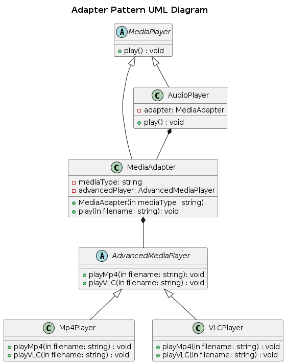

## Adapter

Adapter pattern is a structural design pattern that allows objects with incompatible interfaces to work together by wrapping an existing class with a new interface.

### Real World Analogy

Imagine you have a phone charger plug (Adaptee) designed for U.S. outlets, but you are in Europe, where outlets are different (Client). The Adapter is the socket converter that makes them compatible.

### Components

1. Client: code that requires specific interface to work with.
2. Adaptee: the existing interface that needs to be adapted.
3. Adapter: a wrapper that translates the interface into one the client expects.

### Problem
Developing a universal media player which supports multiple file formats. Currently the system is build around a simple media player interface (MediaPlayer) which supports .mp3.

To extend the support for .mp4 and .vlc which are using AdvancedMediaPlayer, there should be an interface which can connect to the MediaPlayer. Without the interface, the MediaPlayer doesn't support AdvancedMediaPlayer.

### Solution
The MediaAdapter class is created in order to act as a bridge between MediaPlayer and AdvancedMediaPlayer.

### UML Diagram

  

### Advantages
- Single Responsibility Principle. You can separate the interface or data conversion code from the primary business logic of the program.
- Open/Closed Principle. You can introduce new types of adapters into the program without breaking the existing client code, as long as they work with the adapters through the client interface.

### Disadvantages
The overall complexity of the code increases because you need to introduce a set of new interfaces and classes.
