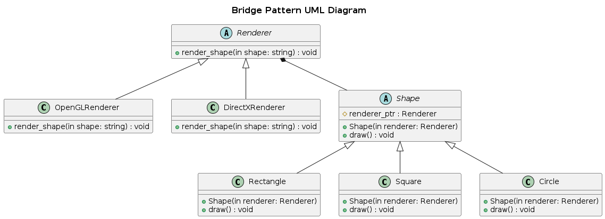

## Bridge

Bridge is a structural design pattern that decouples an abstraction from its implementation, allowing both to evolve independently

### Real World Analogy
Consider a remote control (abstraction) and a television (implementation). Different remote control can operate different TVs without being tightly coupled.

### Components
- Abstraction (High-Level Control) [Shape]
- Refined Abstraction (Specific versions of Abstractions) [Circle, Rectangle]
- Implementation (Low Level Details) [Renderer]
- Concrete Implementation (Specific Implementations) [OpenGLRenderer, DirectXRenderer]

```
Abstraction (Shape)
   ├──> Refined Abstraction (Circle, Rectangle)
   │
   ├──> Implementation (Renderer)
           ├──> Concrete Implementations (OpenGLRenderer, DirectXRenderer)

```

### Problem

A company is designing a cross-platform drawing application that supports multiple shapes (like circles and squares). The rendering should work on different graphics libraries (like OpenGL and DirectX).

- The traditional approach would require creating multiple subclasses for each combination of shape and rendering library, leading to a combinatorial explosion.
- The Bridge pattern allows the Shape hierarchy (abstraction) and Rendering hierarchy (implementation) to evolve independently, avoiding unnecessary subclasses.

That means, Shapes    -> Circle
                      -> Rectangle
            Renderer  -> OpenGL
                      -> DirectX
To make it compatible, we have to make another two classes CircleOpenGL, CircleDirectX. This will lead to exploding class problem,                    

### Solution
To avoid the exploding class problem, the bridge pattern is applied. This decouples the abstraction (Shape) from the implementation (Renderer). Instead of creating subclasses for each combination, separate Renderer hierarchy is introduced, allowing independent extension of both hierarchies.  

### UML Diagram
<p align="center">
  
</p>

### Advantages
- Platform independent classes and apps
- Client code works well with high level abstractions. Not exposed to platform details.
- Open/Closed Principles: new abstractions and implementations can be introduced independently from each other.
- Single Responsibility Principle. You can focus on high-level logic in the abstraction and on platform details in the implementation.


### Disadvantages
- You might make the code more complicated by applying the pattern to a highly cohesive class.