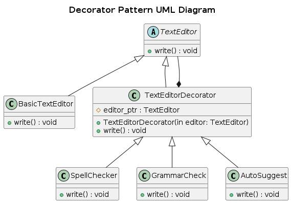

## Decorator

The Decorator Pattern is a structural design pattern that allows adding new functionality to objects dynamically at runtime without modifying their existing code. It wraps the original object inside a decorator class that enhances its behavior.

### Real-World Analogy
Think of a coffee-shop where one can buy a coffee. In that coffee, one can add more features like sugar, milk, cream, etc.

- the base coffee remains same
- the decorators (milk, sugar, cream, etc.) wrap the base coffee without modifying the original coffee.

Another example, wearing clothes is an example of using decorators. When you’re cold, you wrap yourself in a sweater. If you’re still cold with a sweater, you can wear a jacket on top. If it’s raining, you can put on a raincoat. All of these garments “extend” your basic behavior but aren’t part of you, and you can easily take off any piece of clothing whenever you don’t need it.

### Components
- Component (Base Interface) : common interface for both the base class and decorators.
- Concrete Component (Original Object) : class whose functionality we want to extend dynamically.
- Decorator (Abstract Wrapper) : inherits from `Component` and contains a reference to the `Component` it decorates.
- Concrete Decorator (Extensions) : implement additional functionalities while keeping a reference to the base component.

### Problem
A text editor allows users to write text. Over time, users want additional features like:
- spell checking
- grammar checking
- auto-suggestions
  
Instead of modifying the core text editor class (which violates the Open-Closed Principle), we need a way to dynamically add these features without modifying the existing code.

### Solution
We use the Decorator Pattern to wrap the TextEditor with additional functionality:

- The base TextEditor class remains unchanged.
- We create decorator classes (SpellChecker, GrammarChecker, etc.) that wrap around TextEditor to extend its behavior.
- Each decorator modifies the output without altering the original class.

### UML Diagram

  

### Advantages 
- Extensibility : New features can be added without modifying existing code.
- Flexible Composition : Multiple decorators can be combined dynamically at runtime.
- Follows Open-Closed Principle : The original class remains unchanged.

### Disadvantages
- Increased Complexity : Can lead to a large number of small classes.
- Debugging Can Be Harder : Since functionality is spread across multiple wrappers.