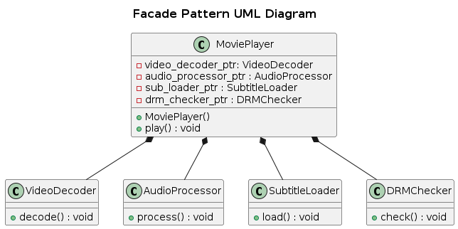

## Facade

The Facade Pattern is a structural design pattern that provides a simplified, high-level interface to a complex system of classes, libraries, or APIs. It hides the complexity and allows clients to interact with a single unified interface instead of dealing with multiple subsystems directly.

### Real-World Analogy

Imagine using a home theater system with multiple components (TV, speakers, DVD player, gaming console, etc.).

- Instead of manually operating each device separately, you have a universal remote (Facade) that provides a single point of control.
- Pressing one button turns everything on and sets it up without needing to interact with each component individually.

### Components
- Subsystem Classes – The complex system that contains multiple independent classes.
- Facade – Provides a simple, unified interface to the subsystem.
- Client – Interacts only with the Facade instead of dealing with subsystem complexities.

### Problem
A video streaming service (like Netflix) requires multiple steps to watch a movie:

- Decode video and audio
- Load subtitles
- Check digital rights management (DRM)
- Adjust resolution based on internet speed
- Play the video

The client should not have to deal with all these steps manually. Instead, we need a simplified API that hides this complexity and provides a single function to "Play Movie".

### Solution
Introduce a Facade Class (MoviePlayer) that encapsulates all the complex operations of video decoding, audio processing, subtitle loading, and DRM checking inside a simple function playMovie().

- The client only calls playMovie(), and the Facade handles everything internally.
- The subsystem classes still exist, but the client doesn’t need to interact with them directly.

### UML Diagram

  

### Advantages
- Simplifies Usage : Clients interact with a single, easy-to-use interface.
- Decouples Complex Systems : The facade shields clients from system complexity.
-  Improves Maintainability : Changes in subsystems don’t affect the client directly.
-

### Disadvantages
- Can Become a God Object : If not properly designed, the facade may become too large and violate Single Responsibility Principle (SRP).
- Reduces Flexibility : Advanced users may need direct access to subsystem functionality, but the facade abstracts them away.
