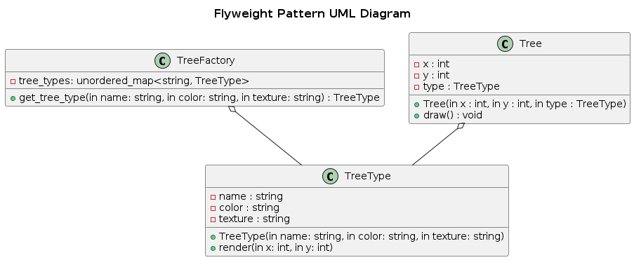

## Flyweight

The Flyweight Pattern is a structural design pattern that minimizes memory usage by sharing common parts of objects instead of storing duplicate data. It is used when a large number of similar objects are needed but storing them individually would be inefficient.

### Real-World Analogy
Imagine a text editor where each character is an object.

- Instead of storing a separate object for every occurrence of a letter (e.g., multiple 'A's), the system stores one shared object for 'A' and references it whenever needed.
- This significantly reduces memory usage and improves performance when handling large texts.

### Components

- Flyweight (Interface/Abstract Class) → Defines shared properties among objects.
- ConcreteFlyweight (Shared Object) → Stores intrinsic state and is shared among clients.
- UnsharedFlyweight (Unique Objects, Optional) → Objects that cannot be shared.
- FlyweightFactory → Creates and manages flyweights, ensuring reuse.
- Client → Uses flyweights and provides extrinsic states when needed.

### Problem
A game engine needs to render thousands of trees in a large open-world game.

- Each tree has a unique position but shares the same model, texture, and colors.
- Storing a separate object for each tree wastes memory since most properties are identical.

### Solution

- Use the Flyweight Pattern to store shared tree data (model, texture, color) in a TreeType object.
- Keep unique data (position, scale) separate.
- The Flyweight Factory ensures that trees with the same type reuse the same shared object instead of creating new ones.

### UML Diagram

  

### Advantages
- Reduces Memory Usage : Avoids duplicate storage of identical data.
- Improves Performance : Speeds up rendering and object management.
- Better Scalability : Allows large numbers of objects to exist efficiently.

### Disadvantages
- Increased Complexity – Managing shared and unique state requires careful design.
- Not Always Suitable – Only useful when many objects share common data.
