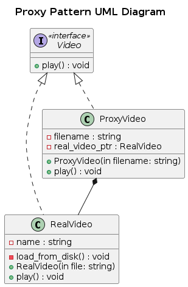

## Proxy

The Proxy Pattern is a structural design pattern that provides a surrogate or placeholder for another object to control access to it. It is used to add a level of control, security, or optimization when interacting with a resource-intensive object.

### Real-World Analogy
Think of a bank ATM machine:

- The ATM machine (Proxy) acts as an intermediary between the customer and the bank's central system (Real Subject).
- Instead of giving customers direct access to the bank’s core systems, the ATM verifies identity, processes transactions, and provides limited access.
- This ensures security, controlled access, and optimized performance

### Components
- Subject (Interface/Abstract Class) → Declares common methods.
- RealSubject (Actual Implementation) → Contains the actual logic.
- Proxy (Surrogate/Wrapper) → Controls access to RealSubject by adding authentication, caching, or logging.
- Client → Uses the Subject but interacts with it via the Proxy.

### Problem
A video streaming application loads large video files from the disk.

- Each time a video is requested, it takes a long time to load.
- Loading videos that the user has already seen is inefficient.
- The application needs a caching mechanism to avoid reloading videos unnecessarily.

### Solution
- Introduce a Proxy Class that wraps the Video Loader.
- Before loading a video, the Proxy checks if it has already been loaded.
- If available, it returns the cached version, reducing load time.
- This improves performance, efficiency, and user experience.

### UML Diagram

  

### Advantages
- Controls Access – Adds security, authentication, and logging.
- Improves Performance – Uses caching or lazy initialization.
- Encapsulation – Hides complexity from the client.

### Disadvantages
- Adds Complexity – Requires additional classes and logic.
- May Slow Down Operations – If not implemented properly, it can introduce overhead.

